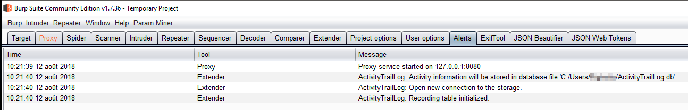
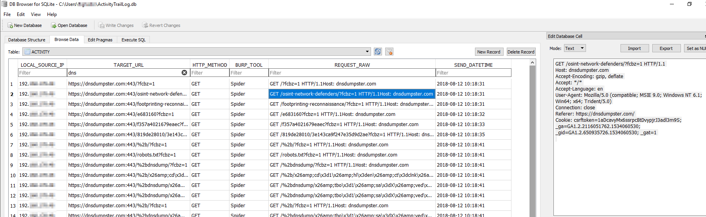
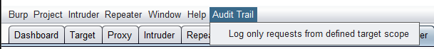
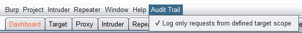
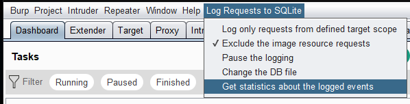
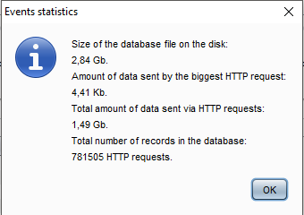

[](https://travis-ci.org/righettod/log-requests-to-sqlite)

# Log Requests to SQLite

This extension has a single objective: 

*Keep a trace of every HTTP request that has been sent via BURP.*

Why?

When I perform an assessment of a web application, it is often spread on several days/weeks and during this assessment, I use the different tools proposed by BURP (Proxy, Repeater, Intruder, Spider, Scanner...) to send many HTTP request to the target application. 

Since a few months, I have met a situation that happens more and more with the time: Some time after the closure of the assessment (mission is finished and report has been delivered), the client ask this kind of question:
* Do you have evaluated this service or this URL?
* Is it you that have sent this "big request" to this service/URL on this date?
* How many requests do you have sent to the application or to this service?
* And so on...

Most of the time, I answer to the client in this way: "This is the IP used for the assessment (the IP is also in the report by the way), check the logs of your web server, web app server, WAF..." because it's up to the client to have the capacity to backtrack a stream from a specific IP address.

In the same time, I cannot give the BURP session file to the client because:
* I cannot ask to a client to buy a BURP licence just to see the session content.
* I cannot ask to a client to learn what is BURP and how to use BURP.
* Requests send via Intruder/Repeater/Spider/Scanner are not kept in the session log.

So, I have decided to write this extension in order to keep the information of any HTTP request sends in a SQLIte database that I can give to the client along the report and let him dig into the DB via SQL query to answer his questions and, in the same time, have a proof/history of all requests send to the target application...

Once loaded, the extension ask the user to choose the target database file (location and name) to use for the SQLite database or to continue using the current defined file in the previous session.

After, the extension silently records every HTTP request send during the BURP session.





# Options

## Scope

There is an option to restrict the logging to the requests that are included into the defined target scope (BURP tab **Target** > **Scope**):



## Images

There is an option to exclude the logging of the requests that target images (check is not case sensitive):



The list of supported file extensions is [here](resources/settings.properties).

## Statistics

There is an option to obtain statistics about the information logged in the database:





# Build the extension JAR file

Use the following command and the JAR file will be located in folder **build/lib**:

```
$ gradlew clean fatJar
```

# Change log

**1.0.4 (Current in progress)**

See the associated [milestone](/../../milestone/3).

**1.0.3**

* Fix the bug described in issue [#4](/../../issues/4).

**1.0.2**

* Add option to exclude image from logging.
* Prepare and finalize publishing of the extension to the BAppStore.

**1.0.1**

* Add the option to restrict the logging to the requests that are included into the defined target scope.

**1.0.0**

* Creation of the extension and initial release.

# SQLite client

Cross-platform: https://github.com/sqlitebrowser/sqlitebrowser
